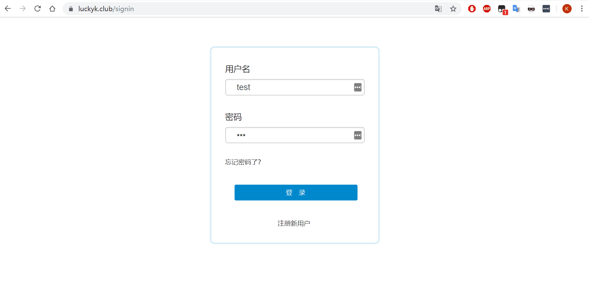
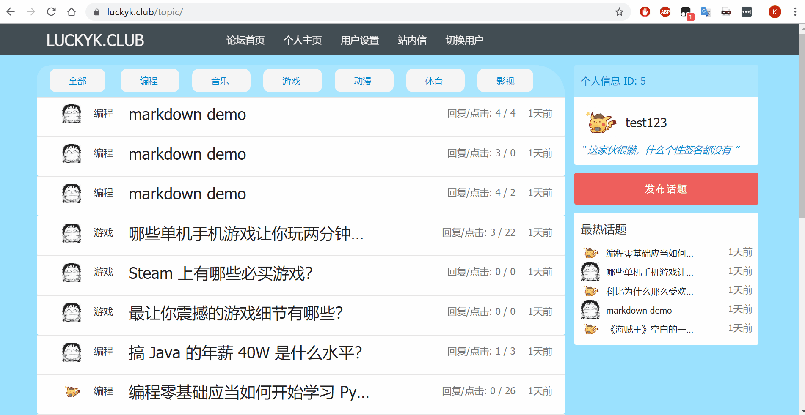
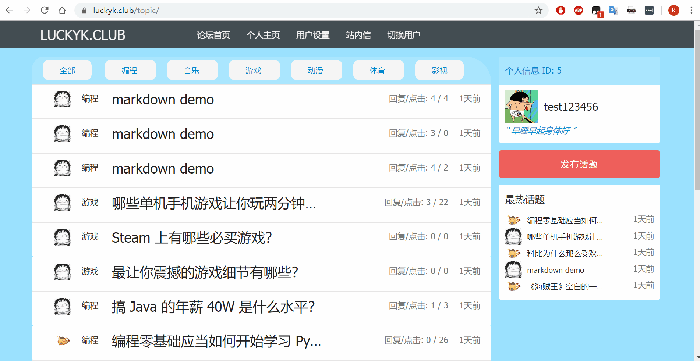
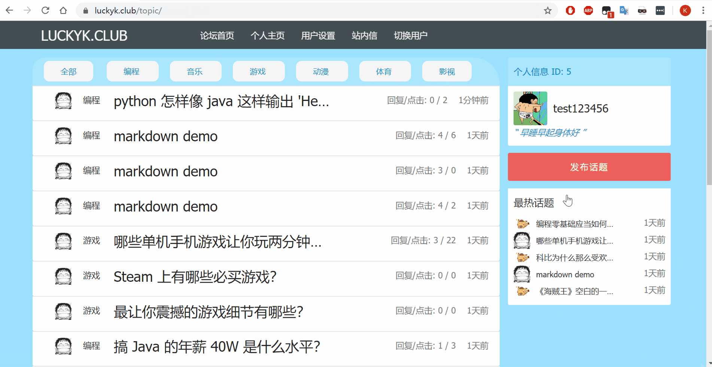
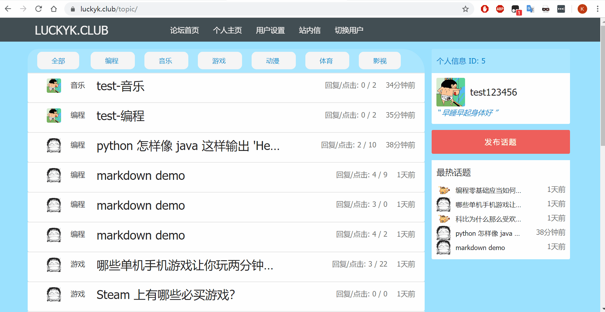
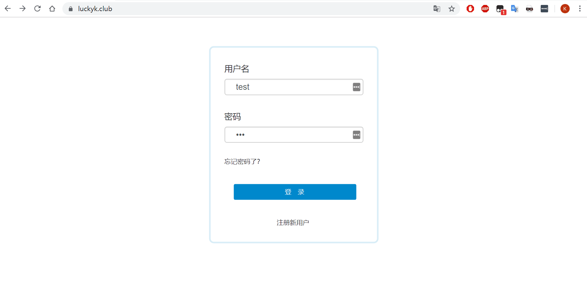
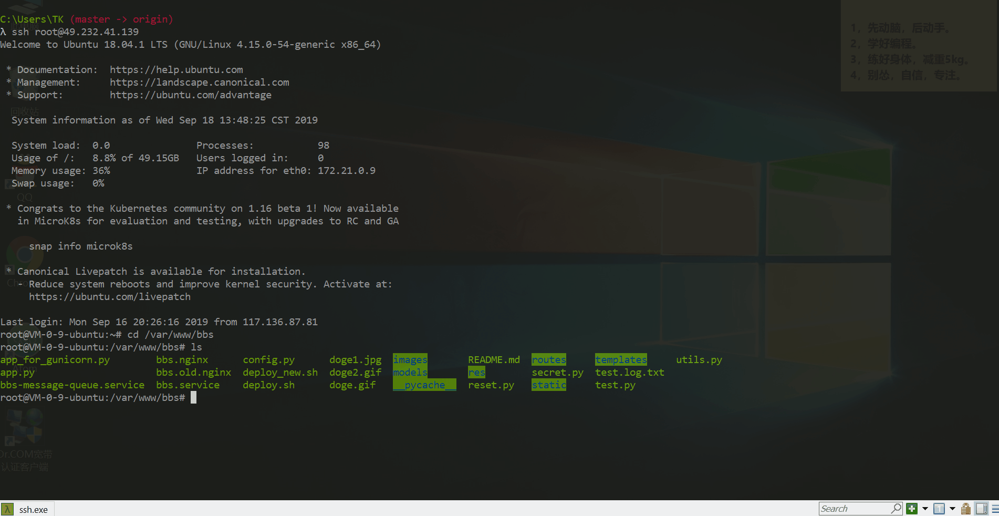

# bbs  Flask 论坛项目 

## 论坛地址：https://luckyk.club/      测试账号： 用户名：test  密码：123

## 技术栈
### Nginx + Gunicorn + Gevent + Flask + MySQL + SQLalchemy + Jinja2 + Redis + Celery

- 使用 Nginx 处理静态请求并反向代理；
- 使用 Redis 存放用户 Session 和页面 Token 实现多进程实现数据共享；
- 实现ORM性能优化，论坛数据存储使用MySQL，针对需要频繁读取的数据使用 Redis 进行缓存优化，降低路由开销；
- Gunicorn 开启多个 worker，实现单机负载均衡，event 实现协程提升并发处理效率；
- Celery 实现消息队列处理邮件发送，保证发送成功，重要信息不被丢失，提高用户体验；
- 通过对用户密码加盐处理保护用户密码安全，利用 Token 对 XSRF 攻击进行防范；

## 论坛功能简介
- 实现用户的注册、登录、验证，修改个人设置如头像、昵称、签名等；
- 论坛主页展示了所有用户发布的所有话题和当前最热话题，以及话题的回复点击数和话题发布时间，并对话题进行分模块管理；
- 个人主页展示了发布话题与参与话题独立展示，并将话题的发布时间并按照倒序排列，最新的话题总在开头；
- 用户设置展示了用户名、密码、个人签名和更改用户头像等功能；
- 实现了话题的发布、删除、评论以及话题的分板块管理，话题内容和评论功能均支持 markdown 语法；
- 实现了话题评论中的 @用户功能，并通过站内信的邮件通知以及相应的邮件提醒相应的用户；
- 实现了用户重置密码功能：用户忘记密码后利用注册的用户名和邮箱进行验证，重置密码；

## 论坛功能展示
- **注册登录** 
  - 若无法正常显示动图 点击此处查看 [注册登录-gif](https://luckyk.club/images/register.gif)

- **修改个人头像、昵称、签名**
  - 若无法正常显示动图 点击此处查看 [修改信息-gif](https://luckyk.club/images/setting.gif)

- **修改个人密码**
   - 若无法正常显示动图 点击此处查看 [修改密码-gif](https://luckyk.club/images/setting_password.gif)

 
- **发布话题**
  - 若无法正常显示动图 点击此处查看 [发布话题-gif](https://luckyk.club/images/topic.gif)

- **话题，评论 markdown 展示 @用户 功能**
  - 若无法正常显示动图 点击此处查看 [评论@用户-gif](https://luckyk.club/images/markdown.gif)

- **删除话题**
  - 若无法正常显示动图 点击此处查看 [删除话题-gif](https://luckyk.club/images/delete.gif)

- **重置密码**
  - 若无法正常显示动图 点击此处查看 [重置密码-gif](https://luckyk.club/images/reset.gif)

- **站内信**
  - 若无法正常显示动图 点击此处查看 [站内信-gif](https://luckyk.club/images/email.gif)

- **执行编写脚本 一键部署代码**
  - 若无法正常显示动图 点击此处查看 [一键部署-gif](https://luckyk.club/images/deploy.gif)

